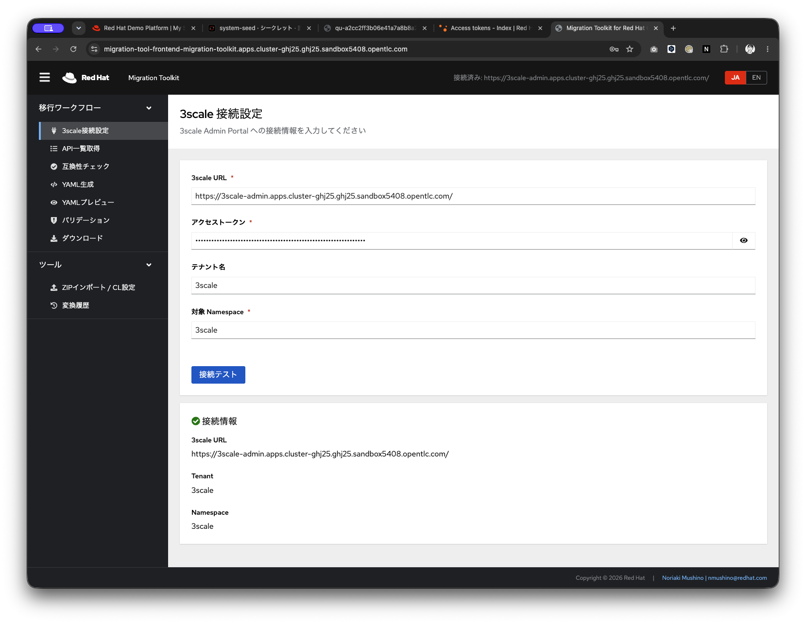
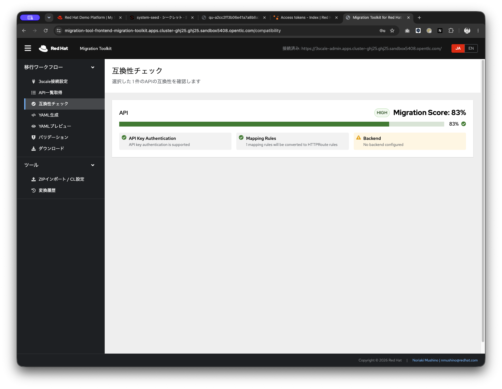
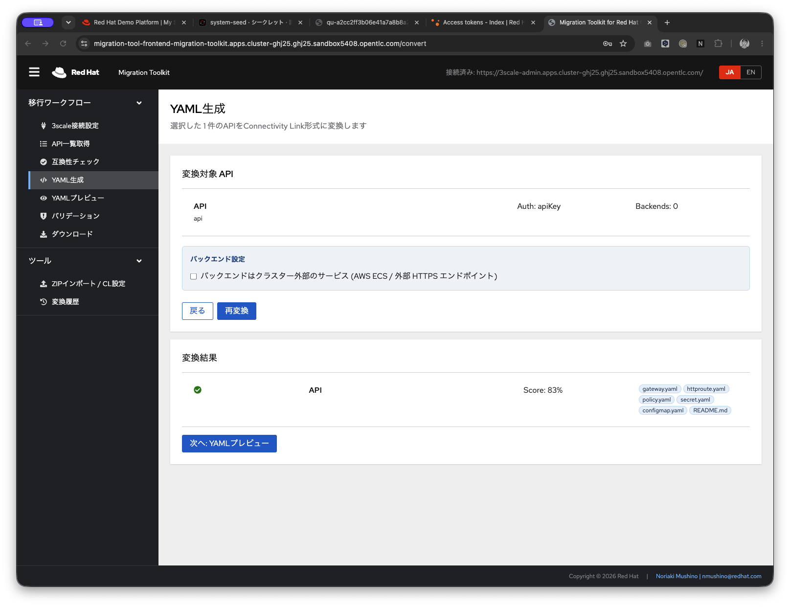
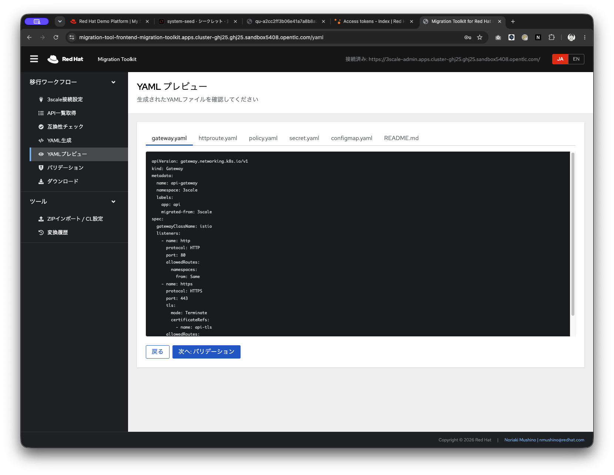
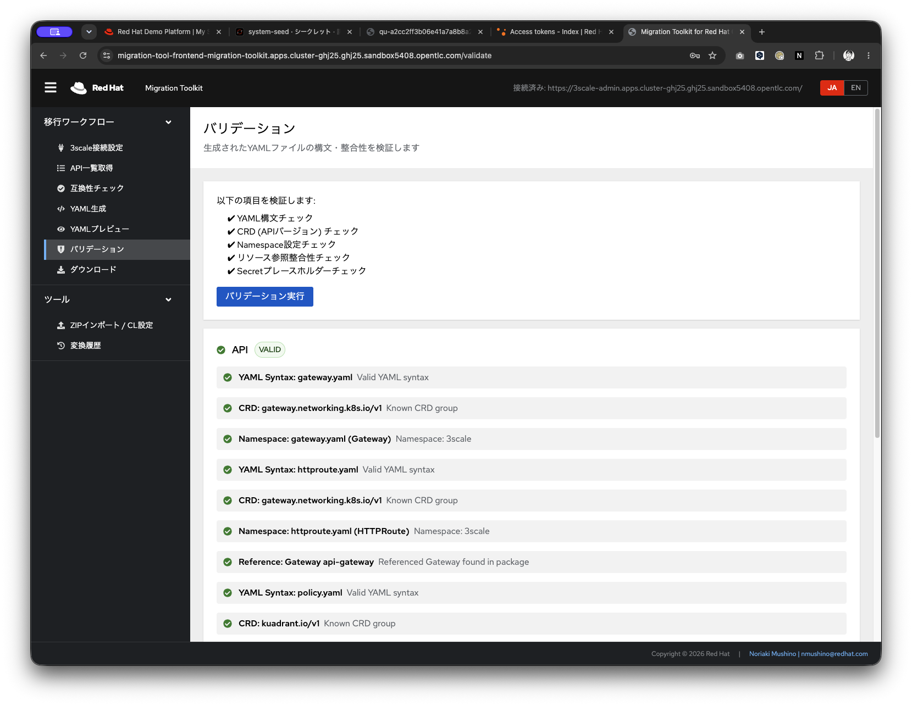
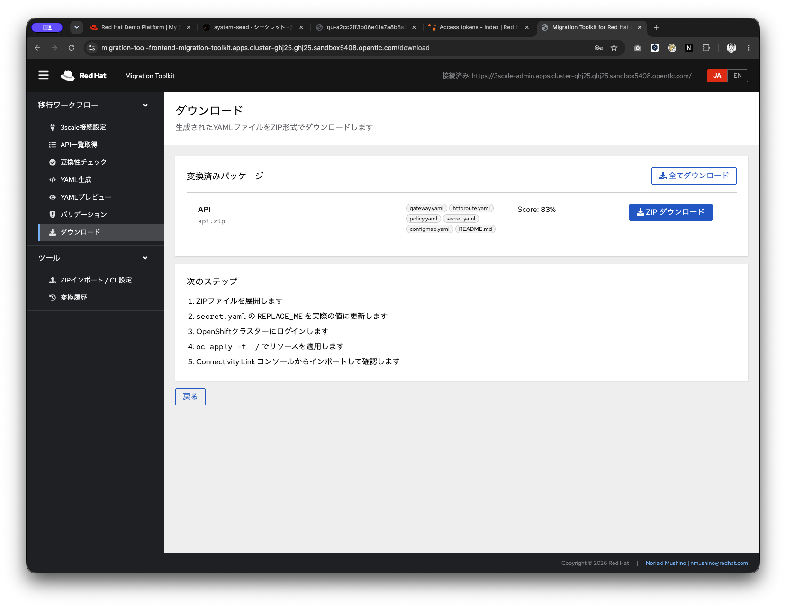
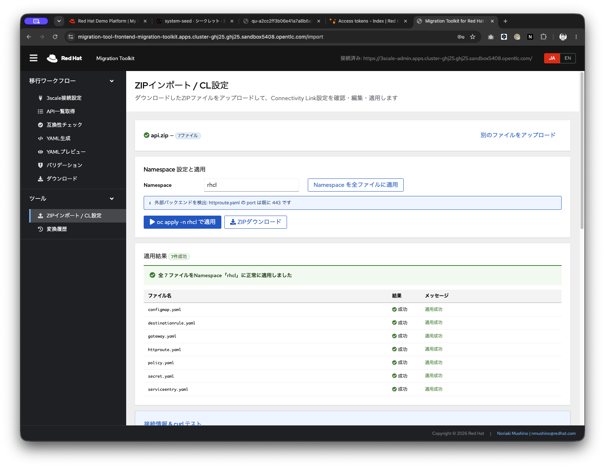
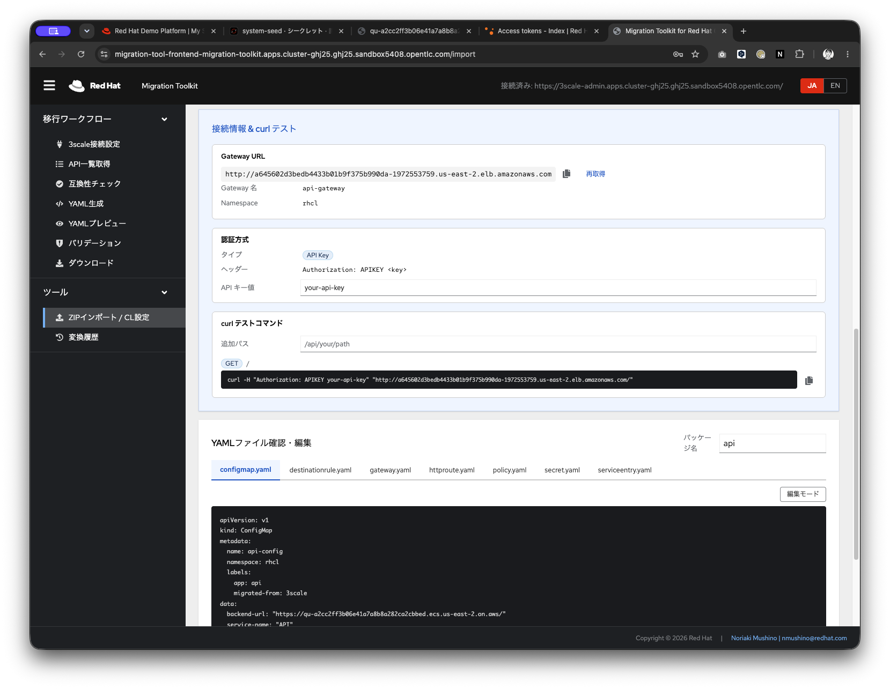

# Migration Toolkit for Red Hat Connectivity Link

3scale から Red Hat Connectivity Link へ移行するための GUI ツールキットです。  
Quarkus バックエンド + React/PatternFly フロントエンド で構成されています。

---

## 目次 / Table of Contents

- [スクリーンショット](#スクリーンショット)
- [前提条件・必要ツール](#前提条件必要ツール)
- [クイックスタート](#クイックスタート)
- [アーキテクチャ](#アーキテクチャ)
- [処理フロー](#処理フロー)
- [機能一覧](#機能一覧)
- [ディレクトリ構成](#ディレクトリ構成)
- [API一覧](#api一覧)
- [データモデル](#データモデル)
- [国際化対応 (i18n)](#国際化対応-i18n)
- [English Documentation](#english-documentation)

---

## スクリーンショット

| 3scale 接続設定 | 互換性チェック |
|:-:|:-:|
|  |  |

| YAML 生成 | YAML プレビュー |
|:-:|:-:|
|  |  |

| バリデーション | ダウンロード |
|:-:|:-:|
|  |  |

| ZIP インポート / CL 設定 | curl 疎通テスト |
|:-:|:-:|
|  |  |

---

## 前提条件・必要ツール

下記ツールの利用が前提となっています
https://github.com/maximilianoPizarro/from-3scale-to-connectivity-link

### ローカル開発環境

| ツール | バージョン | 用途 |
|--------|------------|------|
| Java (OpenJDK) | 21 以上 | バックエンドビルド |
| Apache Maven | 3.9.x 以上 | バックエンドビルド |
| Node.js | 18 以上 | フロントエンドビルド |
| npm | 9 以上 | フロントエンド依存関係管理 |
| Docker / Podman | 最新版 | コンテナイメージビルド（ローカル検証時） |

### OpenShift クラスター

| ツール / コンポーネント | バージョン | 用途 |
|------------------------|------------|------|
| OpenShift Container Platform | 4.14 以上 | デプロイ先クラスター |
| `oc` CLI | クラスターに対応したバージョン | クラスター操作 |
| CrunchyData PostgreSQL Operator | 最新版 | データベース管理（OperatorHub から事前インストール） |
| Red Hat Connectivity Link (Kuadrant) | 最新版 | 移行対象コンポーネント |

> **注意**: CrunchyData PostgreSQL Operator は `openshift-operators` Namespace へ  
> 事前にインストールしてください。インストールスクリプトが自動検出します。

### 3scale 環境

- 3scale Admin Portal への接続 URL と Personal Access Token

---

## クイックスタート

### OpenShift へのフルデプロイ

```bash
# 任意の Namespace を指定してインストール（デフォルト: migration-toolkit）
NAMESPACE=migration-toolkit ./deploy/install.sh

# バックエンドのみデプロイ
NAMESPACE=migration-toolkit ./deploy/install.sh --backend-only

# フロントエンドのみデプロイ
NAMESPACE=migration-toolkit ./deploy/install.sh --frontend-only

# DB のみセットアップ
NAMESPACE=migration-toolkit ./deploy/install.sh --db-only
```

インストールスクリプトが以下を自動処理します:

1. Namespace 作成
2. CrunchyData PostgreSQL Operator インストール待機
3. PostgreSQL クラスター作成（SCC 含む）
4. バックエンド Maven ビルド → S2I → デプロイ
5. フロントエンド npm ビルド → S2I (nginx) → デプロイ
6. アクセス URL 表示

### 言語切替

```bash
# 日本語（デフォルト）
./deploy/install.sh

# 英語で実行
INSTALL_LANG=en ./deploy/install.sh
```

### ローカル開発

```bash
# バックエンド起動（PostgreSQL が localhost:5432 で起動していること）
cd backend
mvn quarkus:dev

# フロントエンド起動（別ターミナル）
cd frontend
npm install --legacy-peer-deps
VITE_API_URL=http://localhost:8080 npm run dev
```

---

## アーキテクチャ

```
               +----------------------+
               |      Web UI          |
               |  (React/PatternFly)  |
               +----------+-----------+
                          |
                    REST API (JSON)
                          |
        +-----------------+------------------+
        |     Quarkus Backend (Java 21)      |
        |                                    |
        | ① 3scale Export                    |
        | ② Parser / Compatibility Checker   |
        | ③ Converter (YAML Generator)       |
        | ④ Validation                       |
        | ⑤ Package Download (ZIP)           |
        | ⑥ Import / Apply to Cluster        |
        |    (RBAC 自動プロビジョニング含む)  |
        | ⑦ ZIP Import 変換履歴              |
        | ⑧ Gateway 情報取得                 |
        | ⑨ Namespace セットアップ           |
        +-----------------+------------------+
                    |               |
       from-3scale-to-connectivity  PostgreSQL
            -link (Adapter)         (CrunchyData)
                    |
          Connectivity Link YAML
         (Gateway / HTTPRoute / AuthPolicy /
          RateLimitPolicy / DestinationRule /
          ServiceEntry / Secret / ConfigMap)
```

**主要技術スタック**

| レイヤー | 技術 |
|---------|------|
| フロントエンド | React 18, PatternFly 5, Vite, TypeScript, react-i18next |
| バックエンド | Quarkus 3.8.4 (Java 21), RESTEasy Reactive, Hibernate ORM Panache |
| データベース | PostgreSQL (CrunchyData Operator 管理) |
| Kubernetes クライアント | Fabric8 Kubernetes Client 6.7.x |
| OpenAPI | SmallRye OpenAPI + Swagger UI (`/q/swagger-ui`) |
| マイグレーション | Flyway (V1〜V3) |
| デプロイ | OpenShift S2I, nginx (フロントエンド静的配信) |

---

## 処理フロー

```
① 3scale 接続設定 (URL / Access Token / Tenant / Namespace 入力)
      ↓
② API 一覧取得 (Service / Backend / MappingRule / Metrics / Policies / Authentication)
      ↓
③ 変換対象選択
      ↓
④ Compatibility Check (スコアリング: JWT / Rewrite / Lua Policy / SOAP など)
      ↓
⑤ YAML 生成 (from-3scale-to-connectivity-link アダプタ経由)
      ↓
⑥ YAML プレビュー / 編集
      ↓
⑦ Validation (YAML 構文 / CRD / Namespace / Secret / Reference 整合性)
      ↓
⑧ ZIP ダウンロード
      ↓
⑨ ZIP Import → Connectivity Link 画面から適用
     ・対象 Namespace に Role/RoleBinding を自動作成
     ・Server-Side Apply でクラスターへ適用
     ・適用後リソースを -o yaml 相当でエクスポート保存
      ↓
⑩ 変換履歴確認 (成功/失敗件数・エラー詳細・適用済み YAML の ZIP 再ダウンロード)
```

---

## 機能一覧

### 1. 3scale 接続設定

画面入力項目:
- 3scale Admin Portal URL
- Personal Access Token
- Tenant 名（オプション）
- 対象 OpenShift Namespace

バックエンドが呼び出す 3scale API:
```
GET /admin/api/services.json
GET /admin/api/backends.json
GET /admin/api/proxy_configs
GET /admin/api/policies
```

### 2. API 一覧取得

取得情報:
- Service 基本情報 (ID / 名称 / デプロイオプション)
- Backend (Private Endpoint)
- Mapping Rules
- Metrics
- Policies
- Authentication 方式 (API Key / OIDC / JWT など)

### 3. Compatibility Check

各 API ポリシー・機能を Connectivity Link でサポートできるか判定:

| 判定 | 意味 |
|------|------|
| ✔ SUPPORTED | そのまま移行可能 |
| ⚠ WARNING | 手動調整が必要 |
| × UNSUPPORTED | 非対応（要カスタム対応） |

Migration Score (0–100%) でトータルの移行難易度を数値化します。

### 4. YAML 生成

`from-3scale-to-connectivity-link` アダプタを経由して以下のリソースを生成:

```
{service-name}/
  gateway.yaml        # Kuadrant Gateway
  httproute.yaml      # HTTPRoute
  policy.yaml         # AuthPolicy / RateLimitPolicy
  secret.yaml         # 認証情報 (REPLACE_ME プレースホルダー)
  configmap.yaml      # 設定値
  destinationrule.yaml # Istio DestinationRule (TLS 設定)
  serviceentry.yaml   # Istio ServiceEntry (外部サービス登録)
  README.md
```

> `secret.yaml` 内の `REPLACE_ME` は手動で実際の値に置き換えてください。

### 5. YAML プレビュー

生成した全ファイルをブラウザ上でコードビューア形式で確認・編集できます。

### 6. Validation

生成 YAML に対して以下を自動チェック:
- ✔ YAML 構文チェック
- ✔ CRD (API バージョン) チェック
- ✔ Namespace 設定チェック
- ✔ リソース参照整合性チェック
- ✔ Secret プレースホルダーチェック

### 7. ZIP ダウンロード

全ファイルを ZIP アーカイブとしてダウンロード。  
ファイル名例: `customer-api.zip`

### 8. ZIP Import / Connectivity Link 設定適用

アップロードした ZIP の YAML を:
- ブラウザ上でプレビュー・編集
- Namespace を一括置換
- `oc apply` コマンドでクラスターへ直接適用（バックエンド経由）

適用時の自動処理:
- 対象 Namespace に `migration-tool-istio-manager` Role と RoleBinding を自動作成（RBAC 自動プロビジョニング）
- Istio / Kuadrant / Gateway API / コア API リソースへの権限を付与
- `apiVersion` の自動正規化（`kuadrant.io/v1beta2 → v1` など）
- 適用後に各リソースをクラスターからエクスポートし履歴に保存

テストコマンド機能:
- 適用後の疎通確認用 curl コマンドを自動生成
- 追加パス入力欄でベース URL にパスを付与可能

### 9. 変換履歴（ZIP Import 専用）

ZIP Import を実行するたびに 1 件の履歴レコードを作成:

| 項目 | 内容 |
|------|------|
| 実行日時 | タイムスタンプ |
| 種別 | ZIP Import / Convert |
| Namespace | 適用先 Namespace |
| ステータス | COMPLETED / PARTIAL / FAILED |
| 成功件数 | 正常適用されたリソース数 |
| 失敗件数 | エラーになったリソース数 |
| エラー詳細 | 失敗リソースのファイル名・Kind・Name・エラーメッセージ（展開表示） |
| YAML ダウンロード | 適用済みリソースを `-o yaml` 相当でエクスポートした ZIP |

操作:
- チェックボックスで複数選択して一括削除（DB サイズ削減目的）
- 各行の ZIP ダウンロードボタンで適用済み YAML を取得

### 10. Gateway 情報取得

クラスターの Gateway リソース一覧と Listener 情報をリアルタイムに取得。

### 11. Namespace セットアップ

対象 Namespace に Connectivity Link 動作に必要な初期リソースを自動適用。

---

## ディレクトリ構成

```
migration-toolkit-rhcl/
├── backend/                    # Quarkus バックエンド (Java 21)
│   └── src/main/java/com/example/migrationtool/
│       ├── controller/         # REST エンドポイント
│       │   ├── ConnectionController.java   # 3scale 接続テスト
│       │   ├── ExportController.java       # サービス一覧・互換性チェック
│       │   ├── ConversionController.java   # YAML 生成
│       │   ├── ValidationController.java   # YAML バリデーション
│       │   ├── PackageController.java      # ZIP ダウンロード
│       │   ├── ApplyController.java        # クラスター適用・履歴保存・RBAC 自動作成
│       │   ├── ImportController.java       # ZIP アップロード・解析
│       │   ├── HistoryController.java      # 変換履歴 CRUD・ZIP ダウンロード
│       │   ├── GatewayInfoController.java  # Gateway リソース情報取得
│       │   └── SetupController.java        # Namespace セットアップ
│       ├── entity/             # Panache エンティティ (JPA)
│       │   ├── ProjectEntity.java
│       │   └── ConversionHistoryEntity.java
│       ├── model/              # DTO / ドメインモデル
│       ├── util/
│       │   └── Messages.java   # i18n ResourceBundle ラッパー
│       └── resources/
│           ├── application.properties
│           ├── db/migration/
│           │   ├── V1__init.sql            # 初期スキーマ
│           │   ├── V2__add_sequences.sql   # シーケンス追加
│           │   └── V3__import_history.sql  # Import 履歴フィールド追加
│           ├── messages_ja.properties      # バックエンド日本語メッセージ
│           └── messages_en.properties      # バックエンド英語メッセージ
├── frontend/                   # React + PatternFly フロントエンド
│   └── src/
│       ├── pages/              # 各画面コンポーネント
│       │   ├── ConnectionPage.tsx      # 3scale 接続設定
│       │   ├── APISelectionPage.tsx    # API 一覧・選択
│       │   ├── CompatibilityPage.tsx   # 互換性チェック結果
│       │   ├── ConversionPage.tsx      # YAML 生成実行
│       │   ├── YAMLViewerPage.tsx      # YAML プレビュー・編集
│       │   ├── ValidationPage.tsx      # バリデーション結果
│       │   ├── DownloadPage.tsx        # ZIP ダウンロード
│       │   ├── ImportPage.tsx          # ZIP Import・クラスター適用・curl テスト
│       │   └── HistoryPage.tsx         # 変換履歴一覧・削除・ZIP 再ダウンロード
│       ├── api/
│       │   ├── client.ts       # Axios API クライアント
│       │   └── types.ts        # TypeScript 型定義
│       ├── locales/
│       │   ├── ja.json         # 日本語 UI 文字列
│       │   └── en.json         # 英語 UI 文字列
│       ├── i18n.ts             # react-i18next 設定
│       └── App.tsx             # レイアウト・ルーティング
├── deploy/                     # OpenShift プロビジョニング
│   ├── install.sh              # 一括インストールスクリプト（日英対応）
│   ├── backend/                # Backend OpenShift リソース YAML
│   ├── frontend/               # Frontend OpenShift リソース YAML
│   └── postgres/               # PostgreSQL Operator / Cluster / SCC YAML
├── from-3scale-to-connectivity-link/  # 変換アダプタ
└── README.md
```

---

## API 一覧

| Method | Path | 説明 |
|--------|------|------|
| POST | `/api/connection/test` | 3scale 接続テスト |
| GET | `/api/services` | API サービス一覧取得 |
| GET | `/api/services/{id}` | サービス詳細取得 |
| GET | `/api/services/{id}/compatibility` | 互換性チェック |
| POST | `/api/convert` | YAML 生成（変換実行） |
| POST | `/api/validate` | YAML バリデーション |
| POST | `/api/download/zip` | ZIP ダウンロード |
| POST | `/api/apply` | クラスターへ適用（Server-Side Apply・RBAC 自動作成・履歴保存） |
| POST | `/api/import/zip` | ZIP アップロード・解析 |
| GET | `/api/history` | 変換履歴一覧（`exportedYaml` 除く軽量レスポンス） |
| GET | `/api/history/{id}` | 変換履歴詳細 |
| GET | `/api/history/{id}/download` | 変換履歴の適用済み YAML を ZIP ダウンロード |
| DELETE | `/api/history` | 変換履歴の一括削除（ID リスト指定） |
| GET | `/api/history/projects` | プロジェクト一覧 |
| GET | `/api/gateway/info` | Gateway リソース情報取得 |
| POST | `/api/setup/namespace` | Namespace セットアップ |
| GET | `/api/setup/status` | Namespace セットアップ状態確認 |

Swagger UI: `https://<backend-route>/q/swagger-ui`

---

## データモデル

```
Project
  ├── id (PK)
  ├── name
  ├── namespace
  ├── threescaleUrl
  └── createdAt

ConversionHistory
  ├── id (PK)
  ├── source          CONVERT | IMPORT
  ├── namespace       適用先 Namespace
  ├── serviceId       (変換時のみ)
  ├── serviceName     (変換時のみ)
  ├── status          COMPLETED | PARTIAL | FAILED
  ├── compatibilityScore  (変換時のみ)
  ├── totalCount      適用試行リソース数
  ├── successCount    成功リソース数
  ├── failureCount    失敗リソース数
  ├── failureDetails  JSON: [{fileName, kind, name, error}]
  ├── exportedYaml    JSON: {filename → yaml} クラスターからエクスポートした YAML
  ├── yamlContent     (変換時のみ: 生成 YAML 全文)
  └── createdAt
```

Flyway マイグレーション:
- `V1__init.sql` — 初期スキーマ（Project / ConversionHistory）
- `V2__add_sequences.sql` — シーケンス追加
- `V3__import_history.sql` — Import 履歴フィールド追加（source / namespace / totalCount など）

---

## 国際化対応 (i18n)

### フロントエンド

- `react-i18next` を使用
- デフォルト言語: **日本語 (ja)**
- `frontend/src/locales/ja.json` / `en.json` で文字列管理
- マストヘッド右端の **JA / EN** タブで実行時に切り替え可能

### バックエンド

- Java 標準 `ResourceBundle` を使用
- `backend/src/main/resources/messages_ja.properties` / `messages_en.properties`
- `Messages` Bean (`@ApplicationScoped`) が各コントローラに注入される

---

---

# English Documentation

## Red Hat Connectivity Link Migration Toolkit

A GUI toolkit for migrating from 3scale to Red Hat Connectivity Link.  
Built with a Quarkus backend and a React/PatternFly frontend.

---

## Screenshots

| 3scale Connection Setup | Compatibility Check |
|:-:|:-:|
|  |  |

| YAML Generation | YAML Preview |
|:-:|:-:|
|  |  |

| Validation | Download |
|:-:|:-:|
|  |  |

| ZIP Import / CL Config | curl Connectivity Test |
|:-:|:-:|
|  |  |

---

## Prerequisites & Required Tools

### Local Development

| Tool | Version | Purpose |
|------|---------|---------|
| Java (OpenJDK) | 21+ | Backend build |
| Apache Maven | 3.9.x+ | Backend build |
| Node.js | 18+ | Frontend build |
| npm | 9+ | Frontend dependency management |
| Docker / Podman | Latest | Container image build (local testing) |

### OpenShift Cluster

| Tool / Component | Version | Purpose |
|-----------------|---------|---------|
| OpenShift Container Platform | 4.14+ | Target deployment cluster |
| `oc` CLI | Matching cluster version | Cluster operations |
| CrunchyData PostgreSQL Operator | Latest | Database management (pre-install from OperatorHub) |
| Red Hat Connectivity Link (Kuadrant) | Latest | Migration target component |

> **Note**: Install the CrunchyData PostgreSQL Operator into the `openshift-operators`  
> namespace **before** running the install script. The script detects it automatically.

### 3scale Environment

- 3scale Admin Portal URL and a Personal Access Token

---

### Required tools
Use of the following tool is required:
https://github.com/maximilianoPizarro/from-3scale-to-connectivity-link

## Quick Start

### Full Deploy to OpenShift

```bash
# Deploy to a specific namespace (default: migration-toolkit)
NAMESPACE=migration-toolkit ./deploy/install.sh

# Backend only
NAMESPACE=migration-toolkit ./deploy/install.sh --backend-only

# Frontend only
NAMESPACE=migration-toolkit ./deploy/install.sh --frontend-only

# Database only
NAMESPACE=migration-toolkit ./deploy/install.sh --db-only
```

The install script handles:

1. Namespace creation
2. Waiting for CrunchyData PostgreSQL Operator
3. PostgreSQL cluster creation (including SCC)
4. Backend Maven build → S2I → deployment
5. Frontend npm build → S2I (nginx) → deployment
6. Printing access URLs

### Language Selection

```bash
# Japanese (default)
./deploy/install.sh

# Run in English
INSTALL_LANG=en ./deploy/install.sh
```

### Local Development

```bash
# Start backend (PostgreSQL must be running on localhost:5432)
cd backend
mvn quarkus:dev

# Start frontend (separate terminal)
cd frontend
npm install --legacy-peer-deps
VITE_API_URL=http://localhost:8080 npm run dev
```

---

## Architecture

```
               +----------------------+
               |      Web UI          |
               |  (React/PatternFly)  |
               +----------+-----------+
                          |
                    REST API (JSON)
                          |
        +-----------------+------------------+
        |     Quarkus Backend (Java 21)      |
        |                                    |
        | ① 3scale Export                    |
        | ② Parser / Compatibility Checker   |
        | ③ Converter (YAML Generator)       |
        | ④ Validation                       |
        | ⑤ Package Download (ZIP)           |
        | ⑥ Import / Apply to Cluster        |
        |    (auto RBAC provisioning)        |
        | ⑦ ZIP Import Conversion History    |
        | ⑧ Gateway Info                     |
        | ⑨ Namespace Setup                  |
        +-----------------+------------------+
                    |               |
       from-3scale-to-connectivity  PostgreSQL
            -link (Adapter)         (CrunchyData)
                    |
          Connectivity Link YAML
         (Gateway / HTTPRoute / AuthPolicy /
          RateLimitPolicy / DestinationRule /
          ServiceEntry / Secret / ConfigMap)
```

**Technology Stack**

| Layer | Technology |
|-------|-----------|
| Frontend | React 18, PatternFly 5, Vite, TypeScript, react-i18next |
| Backend | Quarkus 3.8.4 (Java 21), RESTEasy Reactive, Hibernate ORM Panache |
| Database | PostgreSQL (managed by CrunchyData Operator) |
| Kubernetes client | Fabric8 Kubernetes Client 6.7.x |
| OpenAPI | SmallRye OpenAPI + Swagger UI (`/q/swagger-ui`) |
| DB Migrations | Flyway (V1–V3) |
| Deployment | OpenShift S2I, nginx (frontend static serving) |

---

## Workflow

```
① Configure 3scale connection (URL / Access Token / Tenant / Namespace)
      ↓
② Fetch API list (Service / Backend / MappingRule / Metrics / Policies / Auth)
      ↓
③ Select APIs to migrate
      ↓
④ Compatibility Check (scoring: JWT / Rewrite / Lua Policy / SOAP, etc.)
      ↓
⑤ Generate YAML (via from-3scale-to-connectivity-link adapter)
      ↓
⑥ Preview / edit YAML in browser
      ↓
⑦ Validation (YAML syntax / CRD / Namespace / Secret / Reference)
      ↓
⑧ Download as ZIP
      ↓
⑨ ZIP Import → apply to cluster
     · Auto-create Role/RoleBinding in target Namespace
     · Apply via Server-Side Apply
     · Export applied resources (-o yaml equivalent) and save to history
      ↓
⑩ Review conversion history (success/failure counts, error details, re-download ZIP)
```

---

## Features

### 1. 3scale Connection Setup

Input fields:
- 3scale Admin Portal URL
- Personal Access Token
- Tenant name (optional)
- Target OpenShift Namespace

3scale APIs called by the backend:
```
GET /admin/api/services.json
GET /admin/api/backends.json
GET /admin/api/proxy_configs
GET /admin/api/policies
```

### 2. API List

Information retrieved:
- Service basics (ID / name / deployment option)
- Backend (Private Endpoint)
- Mapping Rules
- Metrics
- Policies
- Authentication type (API Key / OIDC / JWT, etc.)

### 3. Compatibility Check

Evaluates whether each API policy/feature can be migrated to Connectivity Link:

| Result | Meaning |
|--------|---------|
| ✔ SUPPORTED | Migrates as-is |
| ⚠ WARNING | Manual adjustment required |
| × UNSUPPORTED | Not supported (requires custom handling) |

A Migration Score (0–100%) quantifies the overall migration effort.

### 4. YAML Generation

Resources generated via the `from-3scale-to-connectivity-link` adapter:

```
{service-name}/
  gateway.yaml         # Kuadrant Gateway
  httproute.yaml       # HTTPRoute
  policy.yaml          # AuthPolicy / RateLimitPolicy
  secret.yaml          # Credentials (REPLACE_ME placeholders)
  configmap.yaml       # Configuration values
  destinationrule.yaml # Istio DestinationRule (TLS)
  serviceentry.yaml    # Istio ServiceEntry (external service)
  README.md
```

> Replace `REPLACE_ME` placeholders in `secret.yaml` with actual values before applying.

### 5. YAML Preview

View and edit all generated files in a code viewer inside the browser.

### 6. Validation

Automated checks on generated YAML:
- ✔ YAML syntax
- ✔ CRD (API version)
- ✔ Namespace configuration
- ✔ Resource reference consistency
- ✔ Secret placeholder detection

### 7. ZIP Download

Download all generated files as a ZIP archive.  
Example filename: `customer-api.zip`

### 8. ZIP Import / Apply Connectivity Link Config

Upload a ZIP and:
- Preview and edit YAML in the browser
- Bulk-replace the target Namespace
- Apply directly to the cluster via `oc apply` (through backend)

Automatic processing on apply:
- Auto-create `migration-tool-istio-manager` Role and RoleBinding in the target Namespace
- Grants permissions for Istio / Kuadrant / Gateway API / core API resources
- Automatic `apiVersion` normalization (e.g., `kuadrant.io/v1beta2 → v1`)
- Exports each applied resource from the cluster and saves to history

Test command feature:
- Generates a curl command for connectivity verification after apply
- Custom path input field to append a path to the base URL

### 9. Conversion History (ZIP Import)

A history record is created for every ZIP Import run:

| Field | Description |
|-------|-------------|
| Timestamp | Execution date/time |
| Type | ZIP Import / Convert |
| Namespace | Target Namespace |
| Status | COMPLETED / PARTIAL / FAILED |
| Success count | Number of successfully applied resources |
| Failure count | Number of failed resources |
| Error details | Filename, Kind, Name, error message per failure (expandable row) |
| YAML download | ZIP of resources exported from cluster after apply |

Actions:
- Checkbox selection for bulk delete (to reduce DB size)
- Per-row ZIP download button to retrieve applied YAML

### 10. Gateway Info

Retrieves Gateway resource list and Listener information from the cluster in real time.

### 11. Namespace Setup

Automatically applies resources required for Connectivity Link to operate in the target Namespace.

---

## Directory Structure

```
migration-toolkit-rhcl/
├── backend/                    # Quarkus backend (Java 21)
│   └── src/main/java/com/example/migrationtool/
│       ├── controller/         # REST endpoints
│       │   ├── ConnectionController.java   # 3scale connection test
│       │   ├── ExportController.java       # Service list & compatibility check
│       │   ├── ConversionController.java   # YAML generation
│       │   ├── ValidationController.java   # YAML validation
│       │   ├── PackageController.java      # ZIP download
│       │   ├── ApplyController.java        # Cluster apply, history save, auto RBAC
│       │   ├── ImportController.java       # ZIP upload & parsing
│       │   ├── HistoryController.java      # History CRUD, ZIP download, bulk delete
│       │   ├── GatewayInfoController.java  # Gateway resource info
│       │   └── SetupController.java        # Namespace setup
│       ├── entity/             # Panache entities (JPA)
│       │   ├── ProjectEntity.java
│       │   └── ConversionHistoryEntity.java
│       ├── model/              # DTOs / domain models
│       ├── util/
│       │   └── Messages.java   # i18n ResourceBundle wrapper
│       └── resources/
│           ├── application.properties
│           ├── db/migration/
│           │   ├── V1__init.sql
│           │   ├── V2__add_sequences.sql
│           │   └── V3__import_history.sql
│           ├── messages_ja.properties
│           └── messages_en.properties
├── frontend/                   # React + PatternFly frontend
│   └── src/
│       ├── pages/              # Page components
│       │   ├── ConnectionPage.tsx
│       │   ├── APISelectionPage.tsx
│       │   ├── CompatibilityPage.tsx
│       │   ├── ConversionPage.tsx
│       │   ├── YAMLViewerPage.tsx
│       │   ├── ValidationPage.tsx
│       │   ├── DownloadPage.tsx
│       │   ├── ImportPage.tsx      # ZIP Import, apply, curl test with custom path
│       │   └── HistoryPage.tsx     # History list, bulk delete, ZIP download
│       ├── api/
│       │   ├── client.ts       # Axios API client
│       │   └── types.ts        # TypeScript type definitions
│       ├── locales/
│       │   ├── ja.json         # Japanese UI strings
│       │   └── en.json         # English UI strings
│       ├── i18n.ts             # react-i18next configuration
│       └── App.tsx             # Layout & routing
├── deploy/                     # OpenShift provisioning
│   ├── install.sh              # All-in-one install script (bilingual)
│   ├── backend/                # Backend OpenShift resource YAMLs
│   ├── frontend/               # Frontend OpenShift resource YAMLs
│   └── postgres/               # PostgreSQL Operator / Cluster / SCC YAMLs
├── from-3scale-to-connectivity-link/  # Conversion adapter
└── README.md
```

---

## API Reference

| Method | Path | Description |
|--------|------|-------------|
| POST | `/api/connection/test` | Test 3scale connection |
| GET | `/api/services` | List API services |
| GET | `/api/services/{id}` | Get service details |
| GET | `/api/services/{id}/compatibility` | Run compatibility check |
| POST | `/api/convert` | Generate YAML (run conversion) |
| POST | `/api/validate` | Validate generated YAML |
| POST | `/api/download/zip` | Download ZIP |
| POST | `/api/apply` | Apply to cluster (Server-Side Apply, auto RBAC, history save) |
| POST | `/api/import/zip` | Upload and parse ZIP |
| GET | `/api/history` | List conversion history (lightweight, excludes exportedYaml) |
| GET | `/api/history/{id}` | Get conversion history entry |
| GET | `/api/history/{id}/download` | Download applied YAML as ZIP |
| DELETE | `/api/history` | Bulk delete history entries by ID list |
| GET | `/api/history/projects` | List projects |
| GET | `/api/gateway/info` | Get Gateway resource info from cluster |
| POST | `/api/setup/namespace` | Apply Namespace setup resources |
| GET | `/api/setup/status` | Check Namespace setup status |

Swagger UI: `https://<backend-route>/q/swagger-ui`

---

## Data Model

```
Project
  ├── id (PK)
  ├── name
  ├── namespace
  ├── threescaleUrl
  └── createdAt

ConversionHistory
  ├── id (PK)
  ├── source          CONVERT | IMPORT
  ├── namespace       target Namespace
  ├── serviceId       (CONVERT only)
  ├── serviceName     (CONVERT only)
  ├── status          COMPLETED | PARTIAL | FAILED
  ├── compatibilityScore  (CONVERT only)
  ├── totalCount      total resources attempted
  ├── successCount    successfully applied resources
  ├── failureCount    failed resources
  ├── failureDetails  JSON: [{fileName, kind, name, error}]
  ├── exportedYaml    JSON: {filename → yaml} exported from cluster after apply
  ├── yamlContent     (CONVERT only: full generated YAML text)
  └── createdAt
```

Flyway migrations:
- `V1__init.sql` — initial schema (Project / ConversionHistory)
- `V2__add_sequences.sql` — sequence additions
- `V3__import_history.sql` — Import history fields (source / namespace / totalCount / etc.)

---

## Internationalization (i18n)

### Frontend

- Powered by `react-i18next`
- Default language: **Japanese (ja)**
- Strings managed in `frontend/src/locales/ja.json` / `en.json`
- Runtime language switch via the **JA / EN** toggle in the masthead

### Backend

- Java standard `ResourceBundle`
- `backend/src/main/resources/messages_ja.properties` / `messages_en.properties`
- `Messages` bean (`@ApplicationScoped`) injected into controllers

---

*Maintained by Noriaki Mushino — nmushino@redhat.com*
